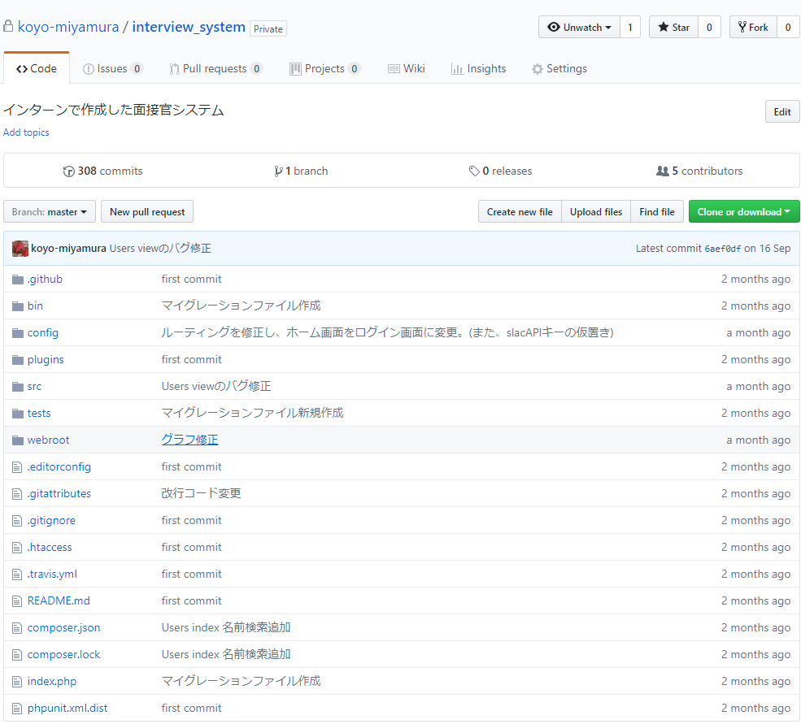

# About this site
Koyo Miyamura's Portfolio.

Created for showing my works in private repository.

\* Note: It will be added as needed.

DEV： github-pages + Jekyll 

# History
From Kumamoto in Japan(and now living in Fukuoka) 

Born October 28, 1994

Graduated from [Depertment of Electrical Engineering and Computer Science, School of Engineering, Kyushu University](http://www.eecs.kyushu-u.ac.jp/e/)　in March, 2017.

Expected to graduate from [Graduate School and Faculty of Information Science and Electrical Engineering, Department of Advanced Information Technology, Kyushu University](http://www.isee.kyushu-u.ac.jp/e/) in March, 2019.

# My works

## My [github](https://github.com/koyo-miyamura) & [gist](https://gist.github.com/koyo-miyamura) ＆ [Qiita](https://qiita.com/koyo-miyamura)
* [github](https://github.com/koyo-miyamura) 

* [gist](https://gist.github.com/koyo-miyamura) 

* [Qiita](https://qiita.com/koyo-miyamura)

## Interview system
  

Internal interview management system developed in the period of internship

(Aug. 2017 ~ Sep. 2017)

Proposal / design was done by three people and development was two people including me.

Now it is used in the company.

Mainly responsible for web design (excluding the part using Javascript) and logic development including login/logout, authority management, and so on.

DEV：　CentOS6 (vagrant) , CakePHP3 

## [Indoor positoning](https://github.com/ishimaru1024/IndoorPositioningTest)
Master's research　(Jul. 2017 ~) ：Indoor positioning implemented on android smartphone

As of October 29, 2017, I introduced git, refactored the code, described the document using github's [wiki](https://github.com/ishimaru1024/IndoorPositioningTest/wiki), added new functions, etc.

## Machine learning
Graduation research　(Sep. 2016 ~ Feb. 2017) ：Identification of programs using performance counters

Using machine learning library [scikit-learn](http://scikit-learn.org/stable/) in python.

1. [Performance counter acquisition script targeted for SPEC 2006 program](https://github.com/koyo-miyamura/perf_analyze_rewrite)
2. [Classification using SVM from the value of the performance counter obtained in 1.](https://github.com/koyo-miyamura/Program_classification)
3. [Plot the value of the performance counter obtained in 1. with dimension reduction to 2 dimensions using PCM](https://github.com/koyo-miyamura/Phase_analysis)

## [Processor design](https://github.com/koyo-miyamura/processor-design)
Laboratory exercise　(May 2016 ~ Jul. 2016)

Design in-order processor with 5-stage pipeline using Verilog.

## [Fukuoka Football Film Festival](http://fkfff.jp)
Web site creation of Fukuoka Football Film Festival(Jan.2016)

According to the given design, creation of Wordpress theme by HTML + CSS (bootstrap) with responsive web design.
